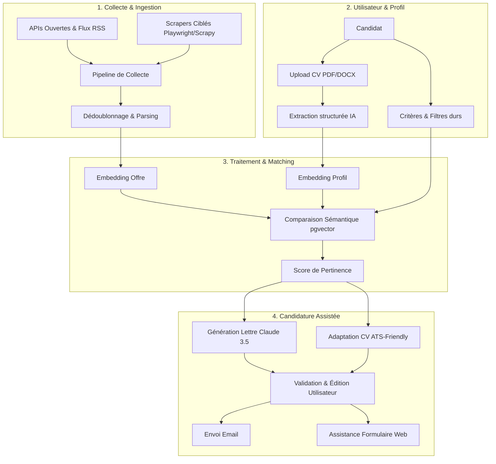
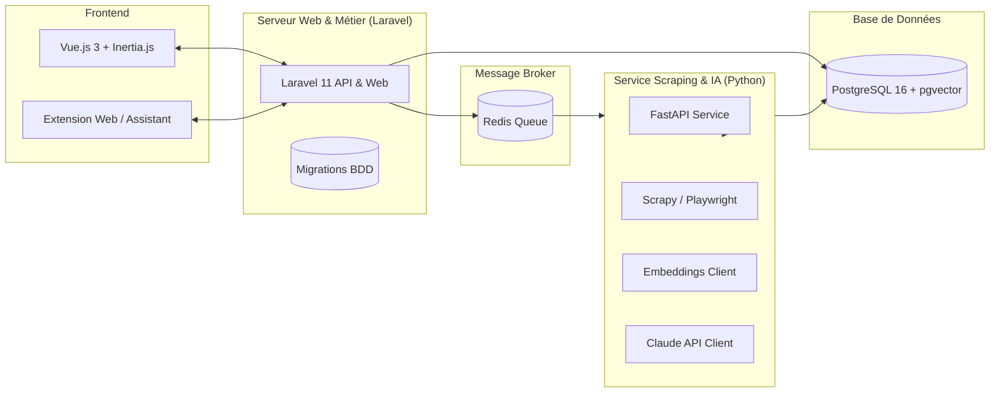
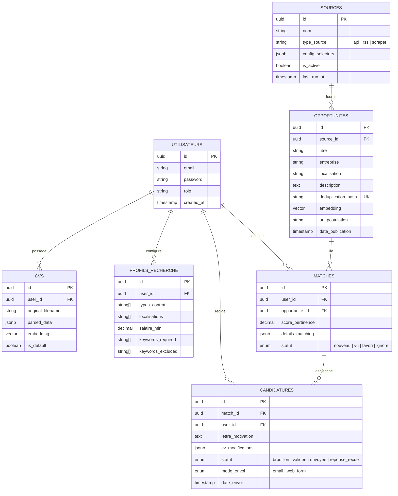
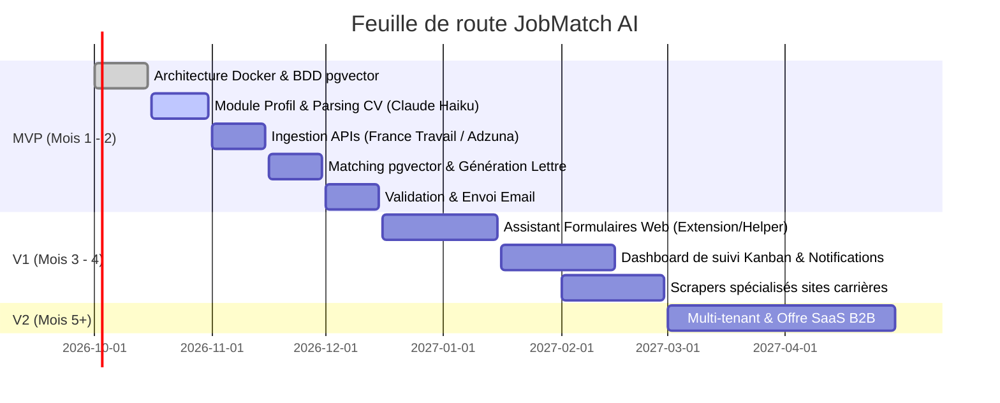

# CAHIER DES CHARGES
## JobMatch AI
**Plateforme de recherche d'opportunités et d'assistance à la candidature**

* **Version :** 1.1 (Révisée)  
* **Date :** Septembre 2026  
* **Porteur de projet :** Grégoire  

---

## 1. Contexte et objectifs

### 1.1 Contexte
De nombreux candidats (chercheurs d'emploi, stagiaires, étudiants en quête de bourses, freelances) passent un temps considérable à parcourir manuellement de multiples plateformes pour trouver des opportunités correspondant à leur profil, puis à rédiger une candidature personnalisée pour chacune. Ce processus est chronophage, répétitif et souvent inefficace.

**JobMatch AI** vise à automatiser la découverte d'opportunités pertinentes et à assister l'utilisateur dans la préparation et la personnalisation de sa candidature, tout en maintenant un contrôle humain strict (*human-in-the-loop*) avant tout envoi.

### 1.2 Objectifs du projet
* **Centraliser la veille d'opportunités** (emploi, stage, bourse, freelance) issues de sources hybrides (APIs ouvertes, flux d'offres et scraping ciblé) en une seule interface.
* **Assurer un matching sémantique intelligent** entre les profils utilisateurs et les opportunités collectées, basé sur la vectorisation et le filtrage multicritère.
* **Générer des candidatures personnalisées à fort impact** : lettres de motivation sur-mesure et propositions de restructuration de CV adaptées à chaque annonce.
* **Faciliter l'envoi et la soumission** (email pré-rempli et assistant de complétion de formulaires web) avec validation humaine obligatoire.
* **Fournir un tableau de bord complet** pour le suivi analytique du cycle de vie des candidatures.

### 1.3 Public cible
* **Phase 1 (MVP & V1)** : Usage individuel (le candidat pilote son profil, ses règles et ses candidatures).
* **Phase 2 (V2)** : Extension multi-utilisateurs (mode SaaS) à destination des structures d'accompagnement à l'emploi (organismes de formation, universités, cabinets de reclassement).

---

## 2. Périmètre fonctionnel

### 2.1 Gestion du profil utilisateur
* **Authentification sécurisée** (inscription, connexion, réinitialisation de mot de passe, gestion de session).
* **Upload multi-formats du CV** (PDF, DOCX) avec extraction automatique par IA des métadonnées structurées : compétences techniques/douces, expériences, diplômes, langues, réalisations clés.
* **Définition des critères de recherche** :
  * Types d'opportunités (CDI, CDD, stage, alternance, freelance, bourse).
  * Secteurs d'activité, intitulés cibles, localisations (avec gestion du télétravail partiel/total).
  * Prétentions salariales ou TJM minimum.
  * Mots-clés obligatoires (*must-have*) et mots-clés rédhibitoires (*deal-breakers*).
* **Conformité RGPD** : export des données personnelles et option de suppression définitive du profil et des CVs associés.

### 2.2 Collecte des opportunités (Ingestion hybride)
Pour maximiser la stabilité et éviter la dépendance exclusive au web-scraping fragile :
* **Priorité 1 — APIs ouvertes & flux de syndication** : intégration des APIs publiques gratuites et stables (ex. API France Travail, Adzuna, Jobposting JSON-LD, flux RSS d'offres).
* **Priorité 2 — Scraping ciblé** : extracteurs dédiés (Scrapy / Playwright) pour les sites carrières d'entreprises clés, plateformes locales et ONG.
* **Dédoublonnage intelligent** : calcul d'un hash d'unicité (entreprise normalisée + intitulé + localisation + extrait description) pour éliminer les réplications entre sources et exécutions.
* **Gestion dynamique des sources** : ajout et paramétrage d'une nouvelle source (URL, sélecteurs, fréquence) via le panneau d'administration sans redéploiement de code.

### 2.3 Matching et scoring sémantique
* **Génération d'embeddings** : vectorisation des descriptions d'offres et des compétences/expériences des profils.
* **Calcul de similarité cosinus via `pgvector`** : attribution d'un score de 0 à 100 %.
* **Application des filtres durs d'exclusion** : élimination stricte avant affichage si un critère rédhibitoire est enfreint (ex. contrat non désiré, hors zone géographique sans télétravail).
* **Dashboard de restitution** : tri des offres par ordre décroissant de pertinence avec explication synthétique du matching (*« Match à 87% : compétences X, Y, Z alignées »*).

### 2.4 Génération assistée de la candidature
* **Lettre de motivation sur-mesure** : prompt engineering calibré exploitant l'intersection exacte entre le profil du candidat et les exigences du poste (ton professionnel, valorisation d'exemples concrets).
* **Recommandation d'adaptation du CV** :
  * Génération d'une proposition de réagencement des compétences et expériences prioritaires pour franchir les filtres ATS (*Applicant Tracking Systems*).
  * Export en format texte structuré / Markdown ou template PDF standardisé épuré.
* **Interface d'édition en direct** : relecture, ajustement manuel et validation impérative par l'utilisateur.

### 2.5 Envoi et suivi de la candidature
* **Canal Email** :
  * Génération automatique de l'objet, du corps d'email et des pièces jointes (CV et lettre au format PDF).
  * Envoi via le compte email de l'utilisateur (SMTP personnel ou client mail local `mailto:`).
* **Canal Formulaire Web (Sites tiers / ATS)** :
  * **Option A (Recommandée) : Extension de navigateur** facilitant l'auto-remplissage des champs (nom, email, lettre, expérience) directement dans le navigateur de l'utilisateur.
  * **Option B : Panneau latéral d'assistance au copier-coller** avec copie rapide en 1-clic pour contourner sans friction les CAPTCHA et systèmes de sécurité tiers.
* **Kanban / Suivi des candidatures** : gestion des statuts (*Brouillon, Validée, Envoyée, Relancée, Entretien, Refusée, Acceptée*).

### 2.6 Système d'alertes et de rappels
* Notifications in-app ou par email lorsqu'une opportunité dépasse un seuil de pertinence (ex. > 85%).
* Alertes sur candidatures en brouillon non finalisées pour ne pas laisser passer les dates limites.

---

## 3. Exigences non fonctionnelles

### 3.1 Architecture et dimensionnement d'infrastructure
* **Environnement d'exécution** : Déploiement obligatoire sur **VPS Linux dédié** (ou plateforme conteneurisée Docker) et **non sur hébergement mutualisé**, en raison des dépendances système de Playwright/Chromium, de l'extension `pgvector` et des workers asynchrones.
* **Dimensionnement initial recommandé** : VPS 4 vCPU, 8 Go RAM minimum (pour allouer 2 Go à Chromium headless, 2 Go à PostgreSQL/pgvector, et le reste pour PHP/Python/Redis).

### 3.2 Performance et asynchronisme
* Aucune tâche de scraping ou d'appel LLM ne s'exécute de façon synchrone dans la requête HTTP de l'utilisateur.
* Temps de matching par embedding pour une nouvelle offre : **< 1 seconde** grâce à l'indexation HNSW de `pgvector`.

### 3.3 Sécurité, confidentialité et RGPD
* Chiffrement en transit (TLS 1.3 / HTTPS) et au repos pour les données sensibles et pièces jointes.
* Données CV et historiques strictement cloisonnés par `user_id`.
* Aucune conservation d'identifiants ou mots de passe de plateformes tierces sur les serveurs.
* Purge automatisée des données de scraping obsolètes (offres expirées depuis plus de 60 jours).

### 3.4 Éthique et conformité
* Respect scrupuleux des directives `robots.txt` et mise en place de *rate limiting* / délais aléatoires pour ne jamais surcharger les serveurs tiers.
* Interdiction stricte de l'envoi de candidatures automatisé non supervisé (*Zero-Spam Policy*).

---

## 4. Architecture technique

### 4.1 Vue d'ensemble des composants

### 4.2 Répartition des responsabilités et gouvernance des données
Pour éviter les conflits d'architecture sur la base partagée (*Shared Database Antipattern*) :

| Composant | Rôle & Responsabilités |
| :--- | :--- |
| **Application Laravel 11 + Vue 3 (Inertia)** | **Source unique de vérité métier** : Authentification, droits d'accès, gestion du schéma BDD (migrations Laravel exclusives), validation des candidatures, dashboard, notifications. |
| **Service Python (FastAPI + Workers)** | **Moteur de calcul et d'ingestion spécialisé** : Exécution des spiders de scraping, parsing de fichiers PDF/DOCX, calcul vectoriel, appels aux APIs LLM. Communique via des jobs Redis orchestrés et/ou des endpoints internes. |
| **PostgreSQL 16 + pgvector** | Stockage relationnel et vectoriel unifié. Indexation vectorielle (HNSW) pour la recherche de plus proches voisins (*cosine distance*). |
| **Redis** | Broker de files d'attente (Laravel Queues & Python Celery / RQ) et cache haute performance. |

### 4.3 Stratégie et étagement des modèles d'IA

| Tâche | Modèle recommandé | Rationale |
| :--- | :--- | :--- |
| **Extraction & Structuration CV / Offres** | *Claude 3.5 Haiku* ou *Gemini 2.5 Flash* | Latence ultra-courte, parsing JSON strict, coût très faible par token. |
| **Calcul des Embeddings (Matching)** | *Voyage AI (voyage-3-lite)* ou *text-embedding-3-small* | Spécialisé pour la similarité sémantique, coût dérisoire, dimensions adaptées à `pgvector`. |
| **Génération de Lettre de Motivation** | *Claude 3.5 Sonnet* | Qualité rédactionnelle supérieure, naturel du style, faible propension aux clichés robotiques. |

---

## 5. Schéma de données (Synthèse des entités)

---

## 6. Gestion des risques et solutions retenues

| Risque identifié | Niveau | Solution adoptée dans le cahier des charges |
| :--- | :---: | :--- |
| **Rupture des sélecteurs HTML suite à refonte de sites cibles** | Élevé | Priorisation des APIs/flux RSS. Pour les scrapers : monitoring automatique des taux d'extraction et alertes en cas de 0 résultat consécutif. |
| **Blocages anti-bot, Cloudflare et CAPTCHA** | Élevé | Pas de forçage côté serveur ; déportation de la soumission web sur le navigateur de l'utilisateur via extension ou aide au copier-coller. |
| **Sanctions LinkedIn relatives aux CGU** | Élevé | Non prioritaire pour la V1. Remplacé par les agrégateurs et sites carrières directs. Si exploré en V2 : via API officielle ou compte d'expérimentation isolé. |
| **Consommation excessive de mémoire (OOM) par Playwright** | Moyen | Mutualisation des instances de navigateur, limitation stricte du nombre de workers concurrents et recyclage fréquent des processus Chromium. |
| **Candidatures génériques ou hallucination de compétences** | Moyen | Validation humaine obligatoire avant envoi ; prompt avec contrainte stricte d'interdiction d'inventer des expériences absentes du CV. |

---

## 7. Phasage et feuille de route

### Détail des phases :
1. **MVP (Socle & validation d'usage individuel)** :
   * Déploiement de l'environnement conteneurisé (Laravel, Python, pgvector, Redis).
   * Parsing d'un CV et extraction structurée via LLM rapide.
   * Collecte via 2 sources stables (ex. API France Travail + flux RSS ciblés).
   * Algorithme de matching vectoriel.
   * Générateur de lettre de motivation et envoi par email personnel.
2. **Version 1 (Expérience complète)** :
   * Assistant de remplissage pour les formulaires web externes.
   * Tableau de bord Kanban de suivi des candidatures.
   * Système de notifications et de relances.
   * Ajout de 3 scrapers de sites carrières d'entreprises cibles.
3. **Version 2 (Échelle & Commercialisation)** :
   * Gestion multi-utilisateurs et accès pour conseillers/coachs en insertion.
   * Métriques avancées de conversion des candidatures.
   * Intégration de connecteurs supplémentaires.

---

## 8. Livrables attendus

1. **Dépôt de code versionné (Git)** :
   * Application Laravel 11 / Vue.js 3 (Inertia).
   * Service Python (FastAPI / Spiders / Worker IA).
2. **Infrastructure-as-Code** :
   * `docker-compose.yml` complet orchestrant : Web, Worker Python, PostgreSQL 16 (avec extension `pgvector`), Redis.
   * Scripts de migration et d'amorçage de la base de données (*seeders*).
3. **Documentation technique et opérationnelle** :
   * Spécification des endpoints API internes et des événements Redis.
   * Guide de création et de maintenance d'un nouveau connecteur de source.
   * Procédure de déploiement et de backup sur VPS.
4. **Guide utilisateur** :
   * Guide pas-à-pas pour la configuration du profil, la relecture des candidatures et le suivi Kanban.
